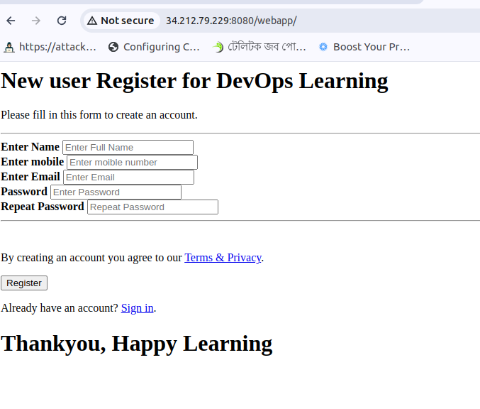

## DevOps Project

### Create Ec2 Instance

```bash
Name: Jenkins-Server
AMI: Amazon Linux 2 AMI
Security Groups: Add 8080 TCP 
```

### Run Ec2 Instance and Install Jenkins Server

```bash
sudo su -
sudo wget -O /etc/yum.repos.d/jenkins.repo https://pkg.jenkins.io/redhat-stable/jenkins.repo
sudo rpm --import https://pkg.jenkins.io/redhat-stable/jenkins.io-2023.key
sudo dnf install java-17-amazon-corretto -y
sudo yum install jenkins
sudo systemctl enable jenkins
sudo systemctl start jenkins
```

### Open public ip:8080 in browser and get password

```bash
sudo cat /var/lib/jenkins/secrets/initialAdminPassword
```

### Skip Installed Plugins and move to the Dashboard

### New Item

```bash
item name: HelloWorldJob
Type: Freestyle Project
```

### Configure HelloWorldJob

```bash
Description: This is a HelloWorld Job
Build: Execute Shell
command: echo "Hello World"
command: uptime
```

### Save and Build Now

### Console Output

```bash
Console Output
Started by user admin
Running as SYSTEM
Building in workspace /var/lib/jenkins/workspace/HelloWorldJob
[HelloWorldJob] $ /bin/sh -xe /tmp/jenkins3792468953931810035.sh
+ echo 'Hello World'
Hello World
+ uptime
 09:34:06 up 20 min,  1 user,  load average: 0.02, 0.08, 0.08
Finished: SUCCESS
```

### Integrates Jenkins with GitHub

```bash
sudo yum install git -y
```

### Install Plugins Jenkins

```bash
GitHub
```

### Configure Jenkins with GitHub

```bash
Manage Jenkins
Tools
Name: Git
Path to Git Executable: /usr/bin/git
```

### Pull Code from GitHub and Build Now

```bash
New Item
item name: PullCodeFromGithub
Type: Freestyle Project
Source Code Management: Git
Repository URL: https://github.com/devarifkhan/hello-world.git
Credentials: None
```

### Code on EC2 Instance

```bash
sudo su -
cd /var/lib/jenkins/jobs/PullCodeFromGithub/workspace
```

### Integrate Maven with Jenkins

```bash
cd /opt
wget https://dlcdn.apache.org/maven/maven-3/3.9.6/binaries/apache-maven-3.9.6-bin.tar.gz
tar -xvzf apache-maven-3.9.6-bin.tar.gz
mv apache-maven-3.9.6 maven
cd ~
pwd
vi .bash_profile
M2_HOME=/opt/maven
M2=$M2_HOME/bin
JAVA_HOME=/usr/lib/jvm/java-17-amazon-corretto.x86_64
PATH=$PATH:$HOME/bin:$JAVA_HOME:$M2_HOME:$M2
```

### Install Maven Plugin to Jenkins and Setup Tools

```bash
Manage Jenkins
Maven Integration

Tools
Name: maven-3.9.6
Maven HOME: /opt/maven

Name: java-17
JAVA_HOME: /usr/lib/jvm/java-17-amazon-corretto.x86_64
```

### Build Java project Using Jenkins

```bash
New Item
item name: FirstMavenProject
Type: Maven Project
Source Code Management: Git
Repository URL:  https://github.com/devarifkhan/hello-world.git
```

### Check in EC2 Instance

```bash
cd /var/lib/jenkins/jobs/FirstMavenProject/workspace
```

### So far we have done the following:
- git ->github ->jenkins ->maven ->java

### Create new EC2 Instance and Install Tomcat Server
```bash
Name: Tomcat-Server
AMI: Amazon Linux 2 AMI
Security Groups: Add 8080 TCP
```
### Get access to the EC2 Instance and Install Tomcat Server
```bash
sudo su -
sudo yum install java-1.8.0-openjdk -y
cd /opt
wget https://dlcdn.apache.org/tomcat/tomcat-10/v10.1.23/bin/apache-tomcat-10.1.23.tar.gz
tar -xvf apache-tomcat-10.1.23.tar.gz
mv apache-tomcat-10.1.23 tomcat
cd tomcat
cd bin
./startup.sh
```

### Open public ip:8080 in browser and check Tomcat Server
### 403 Access Denied Error
```bash
find / -name context.xml
sudo nano /opt/tomcat/webapps/manager/META-INF/context.xml
<!--  <Valve className="org.apache.catalina.valves.RemoteAddrValve"
         allow="127\.\d+\.\d+\.\d+|::1|0:0:0:0:0:0:0:1" /> -->
sudo nano /opt/tomcat/webapps/manager/META-INF/context.xml
<!--  <Valve className="org.apache.catalina.valves.RemoteAddrValve"
         allow="127\.\d+\.\d+\.\d+|::1|0:0:0:0:0:0:0:1" /> -->
cd /bin
./shutdown.sh 
./startup.sh
```

### Open public ip:8080 in browser and check Tomcat Server Again
```bash
cd /conf
sudo nano tomcat-users.xml

<role rolename="manager-gui"/>
<role rolename="manager-script"/>
<role rolename="manager-jmx"/>
<role rolename="manager-status"/>
<user username="admin" password="admin" roles="manager-gui, manager-script, manager-jmx, manager-status"/>
<user username="deployer" password="deployer" roles="manager-script"/>
<user username="tomcat" password="s3cret" roles="manager-gui"/>
     
./shutdown.sh
./startup.sh
```

### Open public ip:8080 in browser and Login with admin and password
```bash
username: tomcat
password: s3cret
```

### change credentials in Jenkins
```bash
Manage Jenkins
username: admin
password: admin
```

### Install Deploy to Container Plugin in Jenkins
```bash
Manage Jenkins
Deploy to Container
```

### Create new Credentials in Jenkins
```bash
username: deployer
password: deployer
```

### Create new Item in Jenkins
```bash
New Item
item name: BuildAndDeployJob
Description: This is a Build and Deploy Job
Type: Maven Project
Source Code Management: Git
Repository URL: https://github.com/devarifkhan/hello-world.git
goals: clean install
warpath: **/*.war
Context Path:
Containers: Tomcat 8.x
Tomcat URL: http://public-ip:8080
```
### Output Tomcat Server


### Upto now we have done the following:
- git ->github ->jenkins ->maven ->java ->tomcat

### Automate the process using Poll SCM
```bash
Build Triggers
Poll SCM
```
