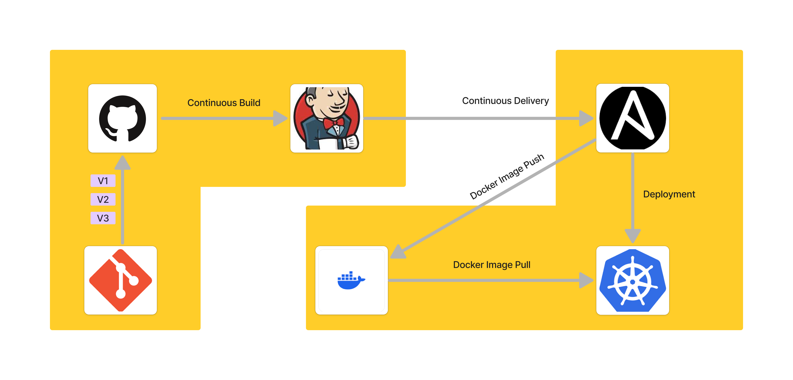

# **End-to-End DevOps Project: From Source Code to Deployment Using Jenkins, Maven, Docker, Ansible, and Kubernetes**



### Create Ec2 Instance

```bash
Name: Jenkins-Server
AMI: Amazon Linux 2 AMI
Security Groups: Add 8080 TCP 
```

### Run Ec2 Instance and Install Jenkins Server

```bash
sudo su -
sudo wget -O /etc/yum.repos.d/jenkins.repo https://pkg.jenkins.io/redhat-stable/jenkins.repo
sudo rpm --import https://pkg.jenkins.io/redhat-stable/jenkins.io-2023.key
sudo dnf install java-17-amazon-corretto -y
sudo yum install jenkins
sudo systemctl enable jenkins
sudo systemctl start jenkins
```

### Open public ip:8080 in browser and get password

```bash
sudo cat /var/lib/jenkins/secrets/initialAdminPassword
```

### Skip Installed Plugins and move to the Dashboard

### New Item

```bash
item name: HelloWorldJob
Type: Freestyle Project
```

### Configure HelloWorldJob

```bash
Description: This is a HelloWorld Job
Build: Execute Shell
command: echo "Hello World"
command: uptime
```

### Save and Build Now

### Console Output

```bash
Console Output
Started by user admin
Running as SYSTEM
Building in workspace /var/lib/jenkins/workspace/HelloWorldJob
[HelloWorldJob] $ /bin/sh -xe /tmp/jenkins3792468953931810035.sh
+ echo 'Hello World'
Hello World
+ uptime
 09:34:06 up 20 min,  1 user,  load average: 0.02, 0.08, 0.08
Finished: SUCCESS
```

### Integrates Jenkins with GitHub

```bash
sudo yum install git -y
```

### Install Plugins Jenkins

```bash
GitHub
```

### Configure Jenkins with GitHub

```bash
Manage Jenkins
Tools
Name: Git
Path to Git Executable: /usr/bin/git
```

### Pull Code from GitHub and Build Now

```bash
New Item
item name: PullCodeFromGithub
Type: Freestyle Project
Source Code Management: Git
Repository URL: https://github.com/devarifkhan/hello-world.git
Credentials: None
```

### Code on EC2 Instance

```bash
sudo su -
cd /var/lib/jenkins/jobs/PullCodeFromGithub/workspace
```

### Integrate Maven with Jenkins

```bash
cd /opt
wget https://dlcdn.apache.org/maven/maven-3/3.9.6/binaries/apache-maven-3.9.6-bin.tar.gz
tar -xvzf apache-maven-3.9.6-bin.tar.gz
mv apache-maven-3.9.6 maven
cd ~
pwd
vi .bash_profile
M2_HOME=/opt/maven
M2=$M2_HOME/bin
JAVA_HOME=/usr/lib/jvm/java-17-amazon-corretto.x86_64
PATH=$PATH:$HOME/bin:$JAVA_HOME:$M2_HOME:$M2
```

### Install Maven Plugin to Jenkins and Setup Tools

```bash
Manage Jenkins
Maven Integration

Tools
Name: maven-3.9.6
Maven HOME: /opt/maven

Name: java-17
JAVA_HOME: /usr/lib/jvm/java-17-amazon-corretto.x86_64
```

### Build Java project Using Jenkins

```bash
New Item
item name: FirstMavenProject
Type: Maven Project
Source Code Management: Git
Repository URL:  https://github.com/devarifkhan/hello-world.git
```

### Check in EC2 Instance

```bash
cd /var/lib/jenkins/jobs/FirstMavenProject/workspace
```

### So far we have done the following:
- git ->github ->jenkins ->maven ->java

### Create new EC2 Instance and Install Tomcat Server
```bash
Name: Tomcat-Server
AMI: Amazon Linux 2 AMI
Security Groups: Add 8080 TCP
```
### Get access to the EC2 Instance and Install Tomcat Server
```bash
sudo su -
sudo yum install java-1.8.0-openjdk -y
cd /opt
wget https://dlcdn.apache.org/tomcat/tomcat-10/v10.1.23/bin/apache-tomcat-10.1.23.tar.gz
tar -xvf apache-tomcat-10.1.23.tar.gz
mv apache-tomcat-10.1.23 tomcat
cd tomcat
cd bin
./startup.sh
```

### Open public ip:8080 in browser and check Tomcat Server
### 403 Access Denied Error
```bash
find / -name context.xml
sudo nano /opt/tomcat/webapps/manager/META-INF/context.xml
<!--  <Valve className="org.apache.catalina.valves.RemoteAddrValve"
         allow="127\.\d+\.\d+\.\d+|::1|0:0:0:0:0:0:0:1" /> -->
sudo nano /opt/tomcat/webapps/manager/META-INF/context.xml
<!--  <Valve className="org.apache.catalina.valves.RemoteAddrValve"
         allow="127\.\d+\.\d+\.\d+|::1|0:0:0:0:0:0:0:1" /> -->
cd /bin
./shutdown.sh 
./startup.sh
```

### Open public ip:8080 in browser and check Tomcat Server Again
```bash
cd /conf
sudo nano tomcat-users.xml

<role rolename="manager-gui"/>
<role rolename="manager-script"/>
<role rolename="manager-jmx"/>
<role rolename="manager-status"/>
<user username="admin" password="admin" roles="manager-gui, manager-script, manager-jmx, manager-status"/>
<user username="deployer" password="deployer" roles="manager-script"/>
<user username="tomcat" password="s3cret" roles="manager-gui"/>
     
./shutdown.sh
./startup.sh
```

### Open public ip:8080 in browser and Login with admin and password
```bash
username: tomcat
password: s3cret
```

### change credentials in Jenkins
```bash
Manage Jenkins
username: admin
password: admin
```

### Install Deploy to Container Plugin in Jenkins
```bash
Manage Jenkins
Deploy to Container
```

### Create new Credentials in Jenkins
```bash
username: deployer
password: deployer
```

### Create new Item in Jenkins
```bash
New Item
item name: BuildAndDeployJob
Description: This is a Build and Deploy Job
Type: Maven Project
Source Code Management: Git
Repository URL: https://github.com/devarifkhan/hello-world.git
goals: clean install
warpath: **/*.war
Context Path:
Containers: Tomcat 8.x
Tomcat URL: http://public-ip:8080
```
### Output Tomcat Server


### Upto now we have done the following:
- git ->github ->jenkins ->maven ->java ->tomcat

### Automate the process using Poll SCM
```bash
Build Triggers
Poll SCM
```
### Now change the ui code of webapp [ index.jsp ] and push in the github and it will automatically build and deploy in the tomcat server


### Upto now we have done the following:
- git ->github ->jenkins ->maven ->java ->tomcat ->poll scm

### Setup Docker Environment
```bash
Name: Docker-Server
AMI: Amazon Linux 2 AMI
Security Groups: Add 8080 TCP
```

### Get access to the EC2 Instance and Install Docker
```bash
sudo su -
yum install docker -y
systemctl enable docker
systemctl start docker
sudo usermod -a -G docker ec2-user
newgrp docker
sudo nano /etc/hostname
sudo init 6
sudo su -
```

### Pull Tomcat Image from Docker Hub
```bash
docker pull tomcat
docker images
docker run -d --name tomcat-container -p 8081:8080 tomcat
docker ps -a
```

### Open public ip:8081 in browser and check Tomcat Server
```bash
set Inbount Rules in Security Groups
Inbount Rules: Add 8081 - 9000 TCP

HTTP Status 404 – Not Found
```

### Fix Tomcat Server Error
```bash
docker exec -it tomcat-container /bin/bash
cd webapps.dist
cp -R * ../webapps/
exit
docker stop tomcat-container
docker run -d --name tomcat2 -p 8082:8080 tomcat:latest
# Again raised the same error
#Dockerfile
FROM tomcat:latest
RUN cp -R /usr/local/tomcat/webapps.dist/* /usr/local/tomcat/webapps

docker build -t demotomcat .
docker run -d --name demotomcat-container -p 8085:8080 demotomcat
```
### Now Issue Fixed And Access the Tomcat Server
```bash
http://public-ip:8085
```

### Upto now we have done the following:
- git ->github ->jenkins ->maven ->java ->tomcat ->poll scm ->docker
### Create a new docker User
```bash
sudo useradd dockeradmin
sudo passwd dockeradmin
1234567
sudo usermod -a -G docker dockeradmin
```

### Activate password authentication in sshd_config and login to dockeradmin
```bash
sudo nano /etc/ssh/sshd_config
PasswordAuthentication yes
#PasswordAuthentication no
sudo service sshd reload
su -u dockeradmin
1234567
```

### Integrate Docker Host With Jenkins and install publish over ssh and Configure Docker Host
```bash
Publish Over SSH
Configure Docker Host
Name: Docker-Server
Hostname: Public IP
Username: dockeradmin
Password: 1234567

Test Configuration
Apply and Save
```

### Jenkins Job to build and copy artifacts to Docker Host
```bash
Item Name: BuildAndDeployContainer
CopyFrom: BuildAndDeployJob
Description: This is a Build and Deploy Container Job
Post Build Actions: Send build artifacts over SSH
Source files: webapp/target/*.war
Remove Prefix: webapp/target
Home directory: /home/dockeradmin

# Check the war file in Docker Host
su - dockeradmin
cd /home/dockeradmin

Remove the existing war file and remote directory and run the job again

# Check the war file in Docker Host
cd ~
ll
exit
```

### make docker directory and copy the war file to docker directory
```bash
cd /opt
sudo chown -R dockeradmin:dockeradmin docker
cd ~
cd /root
mv Dockerfile /opt/docker
sudo chown -R dockeradmin:dockeradmin /opt/docker

# now configure the directory
remote directory: //opt//docker
# now check the war file in docker host
cd /opt/docker
ls
```


### Change the Dockerfile so that we access it
```bash
sudo nano Dockerfile

FROM tomcat:latest
RUN cp -R /usr/local/tomcat/webapps.dist/* /usr/local/tomcat/webapps
COPY ./*.war /usr/local/tomcat/webapps

# now build the image
docker build -t tomcat:v1 .

# now run the container
docker run -d --name tomcatv1 -p 8086:8080 tomcat:v1 
# Access the tomcat server
http://34.222.0.222:8086/webapp/

```
### Now we can see the webapp in the tomcat server from docker


### Automate build and deployment on docker container
```bash
Post-build Actions: Send build artifacts over SSH
Exec command: 
cd /opt/docker,
docker build -t regapp:v1 .;
docker run -d --name registerapp -p 8087:8080 regapp:v1

# stop and delete all container
docker stop $(docker ps -a -q)
docker rm $(docker ps -a -q)
docker image prune
docker image prune -a

# Build now and check the webapp in the docker container
http://34.222.0.222:8087/webapp/
```

### Now if we made any change to the code and deploy it will automatically failed because the container is already running
### Let's fix this issue [ Change the exec command ]
```bash
cd /opt/docker ;
docker build -t regapp:v1 .;
docker stop  registerapp;
docker rm registerapp;
docker run -d --name registerapp -p 8087:8080 regapp:v1


# Build and run
```

### So far we have done the following:
- git ->github ->jenkins ->maven ->java ->tomcat ->poll scm ->docker ->publish over ssh

### Create a new EC2 Instance and Install Ansible
```bash
Name: Ansible-Server
AMI: Amazon Linux 2 AMI
Security Groups: Add 22 TCP
```

### Add User to the Ansible Server
```bash 
sudo useradd ansadmin
sudo passwd ansadmin
1234567

sudo visudo
ansadmin ALL=(ALL)       NOPASSWD: ALL

sudo nano /etc/ssh/sshd_config
PasswordAuthentication yes
#PasswordAuthentication no

# now login with ansadmin
sudo su - ansadmin
ssh-keygen
sudo su -
sudo amazon-linux-extras install ansible2 -y
python --version
ansible --version
```

### Integrate Docker Host with Ansible
```bash
sudo su -
sudo useradd ansadmin
sudo passwd ansadmin
1234567
sudo visudo
ansadmin ALL=(ALL)       NOPASSWD: ALL
```

### configure the docker host in the ansible server
```bash
sudo nano /etc/ansible/hosts [ add private ip of docker host and remove everything ]
cd .ssh
ssh-copy-id private-ip
ansible all -m ping
```


### Integrate Ansible with Jenkins
```bash
Manage Jenkins
Name: Ansible-Server
Hostname: Private IP
Username: ansadmin
Password: 1234567
Test Configuration
Apply and Save
```

### Create a new Jenkins Job
```bash
Item Name: BuildAndDeployContainerUsingAnsible 
CopyFrom: BuildAndDeployContainer
Description: This is a Build and Deploy Container Using Ansible Job
Disable: Poll SCM

#Create /opt/docker directory in Ansible Server
sudo chown ansadmin:ansadmin  docker

#Save and Build Now
ll
```

### Build an image and create container on Ansible Server
```bash
sudo yum install docker
sudo usermod -aG docker ansadmin
newgrp docker
sudo service docker start
cd /opt/docker
sudo nano Dockerfile

FROM tomcat:latest
RUN cp -R /usr/local/tomcat/webapps.dist/* /usr/local/tomcat/webapps
COPY ./*.war /usr/local/tomcat/webapps

sudo chmod 777 /var/run/docker.sock 
sudo docker build  -t regapp:v1 .
sudo docker run -t --name regapp-server -p 8081:8080 regapp:v1
```

### Ansible Playbook to create image and container
```bash
sudo nano /etc/ansible/hosts
172.31.29.98
ansible all -a uptime
ssh-copy-id 34.210.213.100
1234567


sudo nano regapp.yml 
- hosts: ansible
  tasks:
   - name: create docker image
     command: docker build -t regapp:latest .
     args:
      chdir: /opt/docker


ansible-playbook regapp.yml --check
```

### Copy image on to dockerHub

```bash
docker login
username:
password:
docker tag 2f698116327b devarifkhan/regapp:v1
docker push devarifkhan/regapp:v1
```

### Jenkins job to build an image onto ansible
```bash
sudo nano regapp.yml

    - hosts: ansible
    
      tasks:
       - name: create docker image
         command: docker build -t regapp:latest .
         args:
          chdir: /opt/docker
    
       - name: create tag to push image into dockerhub
         command: docker tag regapp:v1 devarifkhan/regapp:v1
    
       - name: push docker image
         command: docker push devarifkhan/regapp:v1
     
ansible-playbook regapp.yml --check


# now go to jenkins

command: ansible-playbook /opt/docker/regapp.yml
```

### Create container using ansible playbook
```bash
sudo nano deploy-regapp.yml

- hosts: dockerhost
  tasks:
  - name: create container 
    command: docker run -d --name regapp-server -p 8082:8080 devarifkhan/regapp:v1

# delete all docker images on docker host
docker stop $(docker ps -a -q)
docker rm $(docker ps -a -q)
docker image prune
chmod 777 /var/run/docker.sock

# run the playbook
ansible-playbook deploy_regapp.yml

# now check the webapp in the browser public ip of dockerhost and port 8082
http://public-ip:8082/webapp/
```

### Fix the issue of the container already running
```bash
sudo nano deploy-regapp.yml
- hosts: dockerhost
  tasks:
  - name: stop existing container
    command: docker stop regapp-server
    ignore_errors: yes
  - name: remove the container
    command: docker rm regapp-server
    ignore_errors: yes
  - name: remove image
    command: docker rmi devarifkhan/regapp:v1
    ignore_errors: yes
  - name: create container
    command: docker run -d --name regapp-server -p 8082:8080 devarifkhan/regapp:v1
```

### Using Ansible to create containers using jenkins
```bash
Exec command: 
ansible-playbook /opt/docker/regapp.yml;
sleep 10;
ansible-playbook /opt/docker/deploy_regapp.yml
```

### So far we have done the following:
- git ->github ->jenkins ->maven ->java ->tomcat ->poll scm ->docker ->publish over ssh ->ansible

### Install Kubernetes Using Eks Ctl

### Create a new EC2 Instance 
```bash
Name: EKS-Server
AMI: Amazon Linux 2 AMI
Security Groups: Add 22 TCP
```

### Access the EC2 Server and Install AWS EKS CTL
```bash
aws --version
curl "https://awscli.amazonaws.com/awscli-exe-linux-x86_64.zip" -o "awscliv2.zip"
unzip awscliv2.zip
sudo ./aws/install

curl -O https://s3.us-west-2.amazonaws.com/amazon-eks/1.29.3/2024-04-19/bin/linux/amd64/kubectl
chmod +x ./kubectl

curl --silent --location "https://github.com/weaveworks/eksctl/releases/latest/download/eksctl_$(uname -s)_amd64.tar.gz" | tar xz -C /tmp
cd /tmp
sudo mv eksctl /usr/local/bin
eksctl version

# update ec2 iam role [ ec2, cloudformation, iam,administrative access ]
```

### Create cluster using eksctl
```bash
 eksctl create cluster --name devarifkhan --region us-west-2 --node-type t2.small 
 cat /root/.kube/config
 kubectl get nodes
 kubectl get all
 kubectl run webapp --image=httpd
  kubectl get pods
 ```

### Run Kubernetes Basic Commands
```bash
kubectl create deployment demo-nginx --image=nginx --port=80 --replicas=2
kubectl get deployment
kubectl get replicaset
kubectl get all
kubectl get pods
kubectl expose deployment demo-nginx --port=80 --type=LoadBalancer
kubectl get all
kubectl delete deployment demo-nginx
kubectl delete service/demo-nginx
# Access the nginx
http://ae154a84e3c3d4e4986056361b489d0d-1170342381.us-west-2.elb.amazonaws.com/
```

### Create manifest file
```bash
sudo nano pod.yml
apiVersion: v1
kind: Pod
metadata:
  name: demo-pod
  labels:
   app: demo-app

spec:
  containers:
    - name: demo-nginx
      image: nginx
      ports:
        - name: demo-nginx
          containerPort: 80
          
          
sudo nano service.yml
apiVersion: v1
kind: Service
metadata:
  name: demo-service

spec:
  ports:
  - name: nginx-port
    port: 80
    targetPort: 80
  selector: demo-app
  type: LoadBalancer
  

kubectl apply -f pod.yml
kubectl get all
kubectl apply -f service.yml
kubectl get all

kubectl describe service/demo-service
```

### Deployment and Service using manifest file to create and access pod
```bash
kubectl delete pod demo-pod
kubectl delete service/demo-service
kubectl get all

sudo nano regapp-deployment.yml


apiVersion: apps/v1 
kind: Deployment
metadata:
  name: devarifkhan-regapp
  labels: 
     app: regapp

spec:
  replicas: 3 
  selector:
    matchLabels:
      app: regapp

  template:
    metadata:
      labels:
        app: regapp
    spec:
      containers:
      - name: regapp
        image: devarifkhan/regapp
        imagePullPolicy: Always
        ports:
        - containerPort: 8080
  strategy:
    type: RollingUpdate
    rollingUpdate:
      maxSurge: 1
      maxUnavailable: 1
      
      
      
kubectl apply -f regapp-deployment.yml 
sudo nano regapp-service.yml

apiVersion: v1
kind: Service
metadata:
  name: devarifkhan-service
  labels:
    app: regapp 
spec:
  selector:
    app: regapp 

  ports:
    - port: 8080
      targetPort: 8080

  type: LoadBalancer


kubectl apply -f regapp-service.yml 

# now check on web url
http://a2c74de74a5434d03b7cab74e95e0239-1691499314.us-west-2.elb.amazonaws.com:8080/webapp/

kubectl get pod
kubectl delete pod devarifkhan-regapp-65b94c56f-5bc9n
useradd ansadmin
passwd ansadmin
1234567
sudo visudo
ansadmin ALL=(ALL)       NOPASSWD: ALL
vi /etc/ssh/sshd_config
PasswordAuthentication yes
#PasswordAuthentication no


service sshd reload

```

### Integrate kubernetes bootstrap server with ansible
```bash
 sudo su - ansadmin
 cd /opt/docker
 mv regapp.yml create_image_regapp.yml
 mv deploy_regapp.yml docker_deployment.yml
 
 sudo nano hosts
 
 localhost

[kubernetes]
172.31.18.120

[ansible]
172.31.29.98

ssh-copy-id 172.31.18.120
ansible -i hosts all -a uptime

sudo nano kube_deploy.yml

---
- hosts: kubernetes
  become: true

  tasks:
  - name: deploy regapp on kubernetes
    command: kubectl apply -f /root/regapp-deployment.yml
    
sudo nano kube_service.yml

---
- hosts: kubernetes
  become: true

  tasks:
  - name: deploy regapp on kubernetes
    command: kubectl apply -f /root/regapp-service.yml

# EKS-BootStrap-Server 

kubectl delete -f regapp-service.yml
kubectl delete -f regapp-deployment.yml 

# Ansible-Server
ansible-playbook /opt/docker/create_image_regapp.yml
sudo nano kube_deploy.yml

---
- hosts: kubernetes
# become: true
  user: root

  tasks:
  - name: deploy regapp on kubernetes
    command: kubectl apply -f regapp-deployment.yml
    

sudo nano kube_service.yml

---
- hosts: kubernetes
# become: true
  user: root
  tasks:
  - name: deploy regapp on kubernetes
    command: kubectl apply -f regapp-service.yml

ansible-playbook -i /opt/docker/hosts kube_deploy.yml
ansible-playbook -i /opt/docker/hosts kube_service.yml 

# EKS Server
kubectl get all
kubectl get pods
 ```

### Create Jenkins Deployment job for kubernetes:
```bash
New Item
Deploy_On_Kubernetes
FreeStyleProject

# run this two command on eks server
kubectl  delete deployment.apps/devarifkhan-regapp
kubectl delete service/devarifkhan-service

#Build and run

# Check on eks
kubectl get all
sudo nano kube_deploy.yml

---
- hosts: kubernetes
# become: true
  user: root

  tasks:
  - name: deploy regapp on kubernetes
    command: kubectl apply -f regapp-deployment.yml
  - name: create service for regapp
    command: kubectl apply -f regapp-service.yml 
```

### CI Job to create Image for kubernetes 
```bash
Change the Item Name Deploy_On_Kubernetes to RegApp_CD_Job
RegApp_CI_Job and copy from Copy_Artifacts_Onto_Ansible
Exec Command: 
ansible-playbook /opt/docker/create_image_regapp.yml;
```

### Enable rolling update to create pod from latest docker image
```bash
RegApp_CD_Job
Add Post Build Action: Build Other Projects
Build other projects: RegApp_CD_Job

sudo nano kube_deploy.yml

---
- hosts: kubernetes
# become: true
  user: root

  tasks:
  - name: deploy regapp on kubernetes
    command: kubectl apply -f regapp-deployment.yml
  - name: create service for regapp
    command: kubectl apply -f regapp-service.yml
  - name: update deployment with new pods if image updated in docker hub
    command: kubectl rollout restart deployment.apps/devarifkhan-regapp    

```

### Clean the Kubernetes Setup:
```bash
kubectl delete deployment.apps/devarifkhan-regapp
kubectl delete service/devarifkhan-service
eksctl delete cluster --name devarifkhan --region us-west-2
```
